# 🧠 DenseHybrid: Hybrid Open-Set Segmentation with Synthetic Negative Data

This project implements **DenseHybrid**, a hybrid open-set semantic segmentation framework for **anomaly detection** in complex visual scenes.  
The model integrates **Dense feature learning**, **DeepLabv3+ backbone**, and **energy-based open-set scoring** to detect out-of-distribution (OOD) regions in semantic segmentation tasks.


---

## ⚙️ Installation and Environment Setup

1. **Create the environment**
   ```bash
   conda env create -f environment.yml
   conda activate densehybrid
2. **If using a CPU-only system**
   ```bash
   conda install pytorch torchvision torchaudio cpuonly -c pytorch -y
3. **Install dependencies manually (if needed)**
   ```bash
   pip install numpy==1.26.4 matplotlib tqdm scikit-learn opencv-python


---

## ⚙️ Core Components

### 🔹 DeepWV3PlusTH (DeeplabV3+)
- Backbone: **WideResNet38**
- Multi-scale **Atrous Spatial Pyramid Pooling (ASPP)** module
- Delta addition: **Attention block** added to refine feature importance
- Dual-head design for:
  - **Segmentation logits**
  - **OOD logits**

### 🔹 THKLOODEvaluation
- Evaluates model on OOD datasets
- Computes metrics:
  - **AUROC** (Area Under ROC Curve)
  - **Average Precision (AP)**
  - **False Positive Rate (FPR)**
- Supports **energy-based scoring** and **confidence visualization**

---

## 📊 Datasets

| Dataset | Description | Purpose |
|----------|-------------|----------|
| **Cityscapes** | Urban street scenes | In-distribution (training) |
| **ADE20K** | Synthetic negatives | OOD augmentation |
| **Fishyscapes (Static)** | Fishyscapes test images | Evaluation dataset |
| **Custom FS Static** | User-provided few images | Manual testing & visualization |

All datasets are expected in the `./data/` directory:
data/
├── cityscapes/
│ ├── leftImg8bit/
│ └── gtFine/
├── fs_static/
│ └── *.png
└── custom_fs_static/
└── test1.png, test2.png, ...

---

## 🔄 Workflow

```mermaid
%%{init: {'theme': 'base', 'themeVariables': {
    'primaryColor': '#ffffff',
    'lineColor': '#000000',
    'textColor': '#000000',
    'actorBorder': '#000000',
    'actorBkg': '#ffffff'
}}}%%
sequenceDiagram
    autonumber

    participant RS as Regular Scene (x⁺)
    participant CROP as Crop Module
    participant NF as Normalizing Flow
    participant AUX as Auxiliary OOD Dataset
    participant MIX as Mixed-Image Generator
    participant FE as Feature Extractor
    participant PROJ as Projection Head
    participant LOSS as Loss Functions
    participant GT as Ground Truth

    %% Input
    RS->>CROP: Select crop(x⁺), generate mask m

    %% Synthetic / Real Negatives
    CROP->>NF: Forward crop through flow (shared weights)
    NF-->>CROP: Encoded crop features
    NF->>MIX: Generate synthetic negative (z ~ N(0,I))

    AUX->>MIX: Provide real negative patch (OOD sample)

    %% Bernoulli choice
    MIX->>MIX: Select synthetic or real patch (Σ ~ Bernoulli(b))

    %% Mixed Content Image
    CROP->>MIX: Provide mask m and spatial location
    MIX->>MIX: Paste negative patch → x′ (mixed image)

    %% Feature Extraction
    MIX->>FE: Extract deep features from x′

    %% Projection
    FE->>PROJ: Project features → logits (ID + OOD)

    %% Supervision
    PROJ->>LOSS: L_d (segmentation loss)
    PROJ->>LOSS: L_x (consistency loss)
    PROJ->>LOSS: L_cla (ID vs OOD loss)
    NF->>LOSS: L_mle + L_jed (flow losses)

    %% Final Output
    LOSS->>GT: Compare with segmentation ground truth
 
```



